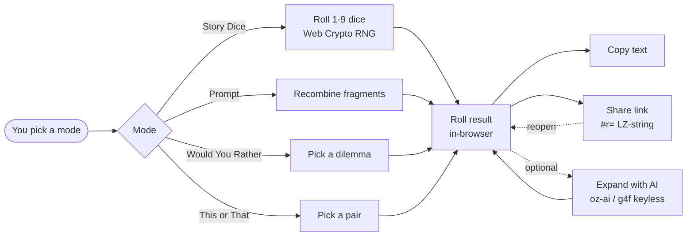

# oriz Play

> Creative play — roll story dice, spin writing prompts, play would-you-rather and this-or-that. AI-expandable, shareable, 100% client-side.

[](./LICENSE)
[](https://github.com/chirag127/oriz-story-dice/stargazers)
[](https://github.com/chirag127/oriz-story-dice/commits/main)
[](https://github.com/chirag127/oriz-story-dice/actions/workflows/deploy.yml)
[](https://astro.build)

## What it is / why it exists

Writer's block and dead-air moments (parties, classrooms, road trips) both need the same thing: a fast, low-stakes spark. **oriz Play** is a single-page creative-play studio that generates that spark on demand — story dice, one-line writing prompts, would-you-rather dilemmas, and this-or-that quickfire picks. Every roll runs in your browser with no signup and no upload; the optional AI expansion turns any roll into a story opening. It exists because most "prompt generators" are ad-heavy, tracked, or gated behind a login — this one is none of those.

## Links

- **Live app:** https://play.oriz.in
- **Info / landing page:** https://chirag127.github.io/oriz-story-dice/
- **Repo:** https://github.com/chirag127/oriz-story-dice
- **llms.txt:** https://play.oriz.in/llms.txt

⭐ If this is useful, please **star the repo** — it helps others find it.

## How it works



Everything above happens client-side. The share link encodes only the roll in the URL fragment (`#r=…`) — it is never sent to a server. The AI path is optional polish through a keyless multi-provider gateway; if it is down, the dice still roll.

## Features

- **Story Dice** — 1-9 categorized dice: Character, Setting, Object, Goal, Obstacle, Mood, Twist, Sense, Wildcard. Each die shows a glyph face with a tumble-and-settle CSS animation.
- **Prompt Roller** — recombines opener / subject / turn fragments into a fresh one-line writing prompt.
- **Would You Rather** — a bank of impossible dilemmas.
- **This or That** — quickfire either/or picks.
- **Expand with AI** — fuse any roll into a vivid story opening (optional, keyless).
- **Fresh prompt pack** — generate a batch of new prompts on a theme.
- **Share** — copy the result text, or a compressed permalink (`#r=…` via LZ-string) that reconstructs the exact roll on open.
- **Recent rolls** history, keyboard-accessible, reduced-motion aware, WCAG-AA contrast.
- **No upload, no signup, no analytics, free** — every roll runs in your browser.

## Tech stack

- **[Astro](https://astro.build)** (`output: 'static'`) — zero-JS-by-default static shell
- **React 19** islands for the interactive studio
- **Tailwind CSS v4** via `@tailwindcss/vite`
- **[@vite-pwa/astro](https://github.com/vite-pwa/astro)** — installable, offline-capable PWA
- **Shared `@chirag127/*` packages** — `oz-ai` (keyless client-side AI over g4f/gpt4free with multi-provider failover, no API key), `oz-chrome` (header/footer shell), `oz-file`, `oz-tokens-base` (design-token contract)
- **[lz-string](https://github.com/pieroxy/lz-string)** — compact, reversible share-link encoding
- **Fonts:** Fraunces + Inter (variable, self-hosted via Fontsource)
- **Randomness:** Web Crypto (`getRandomValues`, rejection-sampled to avoid modulo bias) with a `Math.random` fallback

## Repo structure

```
oriz-story-dice/
├── src/
│   ├── components/
│   │   ├── PlayStudio.tsx        # React island — the interactive studio
│   │   └── PlayStudio.module.css
│   ├── lib/
│   │   ├── data.ts               # dice faces, WYR, this-or-that, prompt parts
│   │   ├── roll.ts               # RNG, roll logic, share codec (encode/decode)
│   │   └── ai.ts                 # optional AI-expansion helper (oz-ai)
│   ├── layouts/Base.astro
│   ├── pages/index.astro
│   └── styles/global.css
├── public/                       # favicon, icons, screenshots, llms.txt, robots.txt
├── gh-info/                      # GitHub Pages info/landing page source
├── test/                         # vitest — pure roll/codec logic
├── astro.config.mjs              # site + PWA manifest
├── PWABUILDER.md                 # Android/store packaging notes
└── .github/workflows/            # deploy.yml, gh-pages-info.yml
```

## Quick start

```bash
npm install          # Windows: append --legacy-peer-deps (pnpm skips @esbuild/win32-x64)
npm run dev          # local dev server
npm run build        # static build → dist/
npm test             # vitest — pure roll/codec logic
npm run deploy       # astro build && wrangler pages deploy (Cloudflare Pages)
```

## Configuration

**No configuration required.** This is a fully client-side tool. AI expansion works keyless via `@chirag127/oz-ai` (g4f multi-provider failover) — no API keys are needed or committed. The `.env.example` exists for parity only.

## PWA

oriz Play is an installable PWA (`@vite-pwa/astro`) and works offline after first load. It can be packaged for the Play Store / app stores via [PWABuilder](https://www.pwabuilder.com) — see [`PWABUILDER.md`](./PWABUILDER.md).

## Screenshots

_Desktop and mobile screenshots live in [`public/screenshots/`](./public/screenshots/) and are wired into the PWA manifest._

## Part of the oriz family

oriz Play is one of ~80 small, fast, client-side tools in the **oriz** family. See how the fleet is built and why at **https://blog.oriz.in**.

## Cost

**$0 on the Cloudflare free tier** — static hosting, no backend, no database.

## Contributing

Issues and PRs welcome. Keep changes client-side, accessible (keyboard + reduced-motion + WCAG-AA), and dependency-light. Tests live in `test/` and run with `npm test`.

## License

[MIT](./LICENSE) © Chirag Singhal

## Author

Chirag Singhal · chirag@oriz.in

## Status & roadmap

Stable and in active use. Ideas: themed dice packs, save/pin favourite rolls, print-friendly export.

## Changelog

Conventional commits are the changelog.
